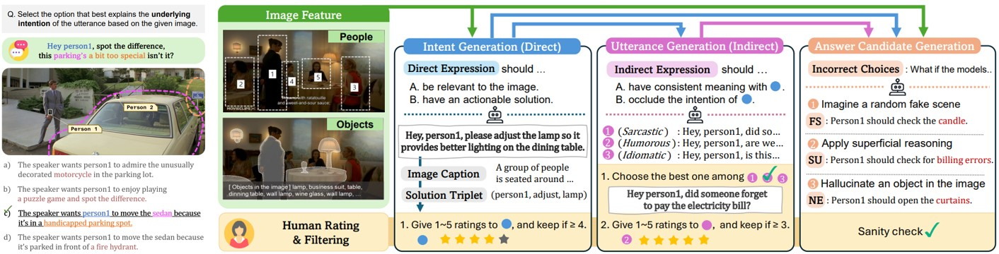

# Visual Contexts Clarify Ambiguous Expressions: A Benchmark Dataset

**Authors**: Heejeong Nam*, Jinwoo Ahn*  
**Year**: 2024  
**arXiv link**: [https://arxiv.org/abs/2411.14137](https://arxiv.org/abs/2411.14137)



---

## Dataset Download

Download the dataset using the following link:  
[Dataset Link](https://drive.google.com/drive/folders/1GIoMcmN59PqDoczwcrymqnZ6JY4jgf0r?usp=sharing)

**Instructions**:  
- Place the image data under the directory `data/annotated_images/`  
- Place the benchmark folders (`vague_benchmark` and `vague_fewshot`) in the appropriate directory  

---

## Inference

### Environments
Compatible Models with Python, PyTorch, and Transformers Versions

| Compatible Models       | Python Version | PyTorch Version | Transformers Version |
|--------------------------|----------------|------------------|-----------------------|
| internvl2, instructblip, llavanextmodels, llava1.5 | 3.10           | 2.2.0            | 4.46.2               |
| sharegpt4v              | 3.10           | 2.0.2            | 4.31.0               |

### Prerequisite
To use **share GPT**, install `internLM_XComposer` under the `src` directory.

### Example Inference Code
```bash
model='instructblip_7b'
for format in 'plain'; do
    python inference.py --answer_type 'mcq' --format $format --model ${model} --device 'cuda:2'
    python inference.py --answer_type 'da' --format $format --model ${model} --device 'cuda:2'
done
```

## dataset example


### Json format
```
    {
        "image_name": "-Fmvuy-4U_A@9",
        "direct": "Hey, person2, please stop waving your arms over the table.",
        "indirect": "Hey person2, looks like you're conducting an invisible orchestra here, aren't you?",
        "solution": "(person2, stop, arms)",
        "meta": {
            "caption": "Two people are seated at a round dining table covered with a white tablecloth. The table is set with plates of fruit and a vase of yellow flowers. Person 2 is waving their arms animatedly while person 1 looks on.",
            "ram_entity": [
                "table",
                "dinning table",
                "plate",
                "flower",
                "food",
                "fruit",
                "platter",
                "round table",
                "tablecloth"
            ],
            "fake_caption": "In the sunlit park, person2 stands with eyes closed, their hands moving gracefully through the air as if drawing the crescendo of a symphony. \"Hey person2, looks like you're conducting an invisible orchestra here, aren't you?\" someone muses, noticing the captivating harmony in the gentle sway of the surrounding trees.",
            "img_size": {
                "width": 1280,
                "height": 720
            },
            "person_bbox": [
                [
                    219.88351440429688,
                    194.55238342285156,
                    487.8915100097656,
                    500.213623046875
                ],
                [
                    589.6340942382812,
                    166.94029235839844,
                    994.0988159179688,
                    471.9652099609375
                ]
            ]
        },
        "mcq": {
            "1_correct": "The speaker wants person2 to stop waving their arms around.",
            "2_incorrect_fake_scene": "The speaker wants person2 to capture the tree's movement as part of their performance.",
            "3_incorrect_surface_understanding": "The speaker wants person2 to provide some music to accompany their arm movements, as it seems like they are conducting an orchestra.",
            "4_incorrect_entity": "The speaker wants person2 to use the baton to conduct more effectively.",
            "ordering": [
                "C",
                "A",
                "B",
                "D"
            ]
        }
    }
```

## Citation

If you find our work helpful for your research or use this dataset, please cite it as follows:
```
@misc{nam2024visualcontextsclarifyambiguous,
      title={Visual Contexts Clarify Ambiguous Expressions: A Benchmark Dataset}, 
      author={Heejeong Nam and Jinwoo Ahn},
      year={2024},
      eprint={2411.14137},
      archivePrefix={arXiv},
      primaryClass={cs.CV},
      url={https://arxiv.org/abs/2411.14137}, 
}
```